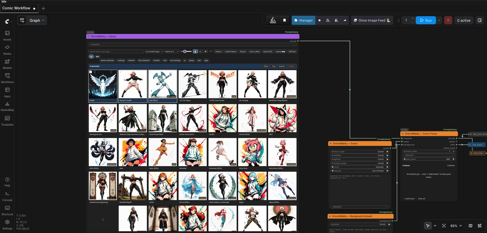
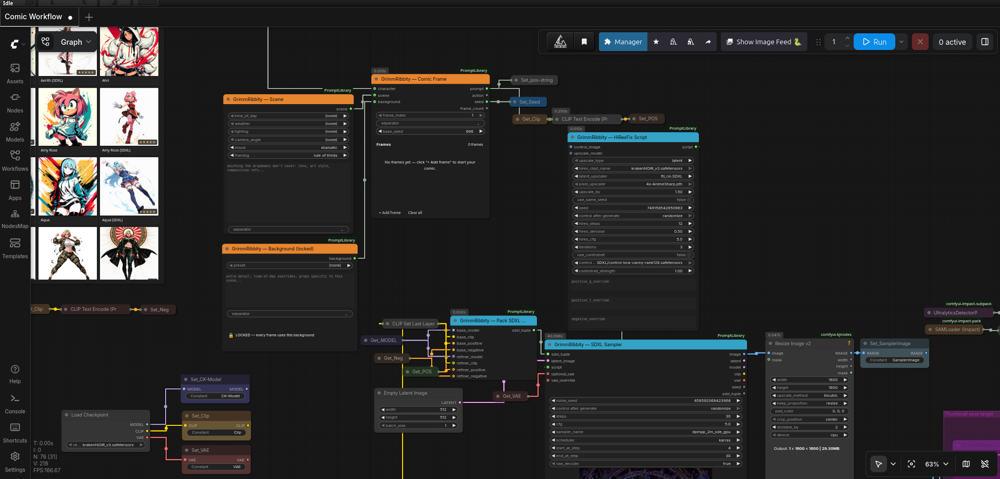
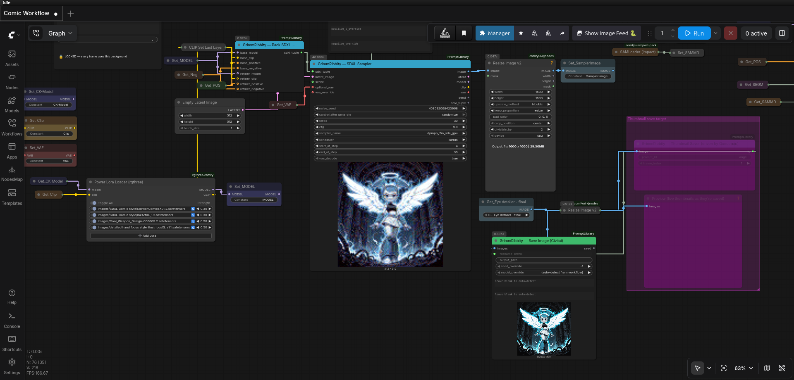

# GrimmRibbity — ComfyUI Custom Node Suite

[](https://github.com/Deaththegrim/ComfyUI-PromptLibrary/actions/workflows/tests.yml)

A visual prompt manager for ComfyUI (formerly *Ribbity — ComfyUI Prompt Library*). Browse a thumbnail grid of saved prompts, tag them, drop them into your workflow with one click. Filesystem-backed — your library survives browser clears and syncs cleanly across machines.

Four nodes, one shared library, no third-party dependencies.

## Screenshots

The Library node embeds a full thumbnail gallery — search, tag-filter, multi-select, and drop the joined prompt text right into your workflow:



The Comic Frame node combines a character, scene, and background entry into one prompt — so a single workflow can iterate across hundreds of style/character/outfit combinations:



Plug it into your sampler with a Power Lora Loader for one-click LoRA stacks:



## Install

> **Get it from one of these — don't grab the unversioned `Code → Download ZIP` button or random commits.**
> - **ComfyUI-Manager** — easiest. Search *GrimmRibbity* (or *Ribbity — Prompt Library*) and install. Manager always pulls the latest tagged release.
> - **GitHub Releases** — [latest release](https://github.com/Deaththegrim/ComfyUI-PromptLibrary/releases/latest). Use the *Source code (zip)* asset, not random older versions.
> - **git clone** — see below; tracks `main`, which is the same as the latest tag.

### Comfy Portable (Windows)

1. Download the *Source code (zip)* asset from the [latest release](https://github.com/Deaththegrim/ComfyUI-PromptLibrary/releases/latest).
2. Extract into `ComfyUI_windows_portable\ComfyUI\custom_nodes\`. The zip extracts as `ComfyUI-PromptLibrary-<version>\` — **rename it to `ComfyUI-GrimmRibbity`** so the path becomes `…\custom_nodes\ComfyUI-GrimmRibbity\__init__.py`.
3. Restart ComfyUI.

### Linux / Mac (git clone)

```sh
cd ComfyUI/custom_nodes
git clone https://github.com/Deaththegrim/ComfyUI-PromptLibrary ComfyUI-GrimmRibbity
# restart ComfyUI
```

The `ComfyUI-GrimmRibbity` argument at the end is the local folder name — keep it as shown.

To update later:
```sh
cd ComfyUI/custom_nodes/ComfyUI-GrimmRibbity
git pull
# restart ComfyUI
```

Your `data/` folder is gitignored, so `git pull` won't touch your library. On first launch after a version bump, the package automatically copies `data/` to `data-backup-<old_version>-<timestamp>/` next to it as a safety net.

## Nodes

After install, find them under **GrimmRibbity/** sub-menus in the node picker:

**Library (the core suite)**
- **GrimmRibbity — Library** — visual gallery picker. Outputs `prompt` (positive) and `negative` STRINGs from the selected entry/entries
- **GrimmRibbity — Multi Library (3 panels)** — three independent gallery panels in one node, replaces 3× Library + 2× Join Strings spaghetti
- **GrimmRibbity — Save** — write prompts to the library during workflow runs (inputs: name, text, optional `negative`, optional `IMAGE` thumbnail, optional tags)
- **GrimmRibbity — Random by Tag** — pick a random library entry by tag filter (outputs text, id, negative). Built for overnight loops
- **GrimmRibbity — Wildcard Expand** — expand `{a|b|c}` alternatives and `__name__` library refs in any string

**Comic / character workflow helpers**
- **GrimmRibbity — Comic Frame** — combines character + scene + background entries into one prompt, with per-frame seed offset for comic batches
- **GrimmRibbity — Scene** — per-frame scene knobs (camera_angle, mood, lighting, framing) + free-text extras
- **GrimmRibbity — Background (locked)** — locked background preset for series consistency
- **GrimmRibbity — Character Anchor** — wraps IPAdapter Plus's UnifiedLoader + Apply pair into a single MODEL→MODEL transform. Pin a character's face/style across comic panels with one node instead of three. Includes a `bypass` toggle and an `attn_mask` input for regional workflows. **Requires [ComfyUI_IPAdapter_plus](https://github.com/cubiq/ComfyUI_IPAdapter_plus).**
- **GrimmRibbity — Comic Page (Regional)** — single-gen multi-panel conditioning. Take a color-coded panel-layout mask + per-panel prompts (up to 6 panels) and emit one CONDITIONING constrained per region. Pair with Character Anchor upstream for character lock across panels. **No third-party node packs required** — uses only ComfyUI's core CLIPTextEncode + ConditioningSetMask.

**Output**
- **GrimmRibbity — Save Image (Civitai)** — SaveImage replacement that writes A1111/Civitai-compatible PNG metadata. Auto-detects model, LoRAs, positive/negative, seed, sampler, scheduler from the workflow trace. Override any field if auto-detect picks the wrong sampler in multi-KSampler workflows
- **GrimmRibbity — Thumbnail Saver** — writes library thumbnails on workflow runs

**Sampling (optional, requires torch)**
- **GrimmRibbity — SDXL Sampler** + **Pack SDXL Tuple** — SDXL sampler with optional refiner + HiResFix script
- **GrimmRibbity — Anima Sampler** — KSampler-shaped sampler with HiResFix script support

**LoRA picker**
- **GrimmRibbity — LoRA Picker** — dropdown picker that emits a `<lora:path:weight>` token for downstream parsing (rgthree Power LoRA Loader / A1111-style)

### Negative prompt field

Every entry can store an optional `negative` field alongside its positive `text`. The Library, Save, and Random nodes all flow it on a second STRING output. Wire that into the negative side of your sampler. Backward-compatible — entries without a negative field load as empty.

## Gallery

The Library node embeds a full gallery in the node body:

- Click a thumbnail to toggle it in the selection. The output is the **joined text** of every selected entry, separated by the node's `separator` input (default `, `).
- Shift-click range-extends the selection from the last-clicked tile.
- The same selection drives the bulk bar at the top — with one or more selected you get **Tag / Export / Delete**.
- Right-click a tile for **Edit / Duplicate / Export this / Delete**.
- Toolbar **▦ / ≡** switches between thumbnail grid and single-column list view (the list is good for dense libraries — 56 px thumb on the left, full name on the right).
- Drag-and-drop tiles to reorder when sort mode is **Manual**.
- Keyboard: arrow keys move focus, **Enter** toggles selection on the focused tile, **Delete** removes, **/** focuses search, **Esc** clears the selection.

### Toolbar

| Control | What it does |
|---|---|
| Search | Matches name, text, tags, and id |
| Model dropdown | Lifts `model:*` tags into a top-level filter (Anima, SDXL, Pony, …) |
| Sort | Manual (drag-reorder) / Name A-Z / Z-A / Newest / Oldest / Recent edit |
| Tile size slider | 60–200 px, persisted per browser |
| Import | Auto-detects `.csv` (columns: `name, text, tags, id` — tags use `;` inside cell) or GrimmRibbity `.zip` |
| Export | Packs currently visible prompts + thumbnails into a zip download |
| Refresh | Reload from disk |

### Tag chips

Tags use `category:value` syntax (e.g. `style:cyberpunk`, `character:elf`). The chip row groups them by category. Chips OR-filter the grid; combine with the search box for AND.

`model:*` tags are special — they're lifted out of the chip row into the dedicated dropdown.

### Editing

Right-click → Edit, or click the `+` tile to add. The modal is non-blocking — drag it around, the canvas stays interactive. Fields:

- **Name** — human-readable label
- **ID** — auto-derived from the name (`Cyberpunk Style` → `cyberpunk_style`); override only if you want a specific filesystem name. Collisions auto-append `_2`, `_3`, …
- **Tags** — comma-separated; autocompletes from existing tags via a `<datalist>`
- **Prompt text** — the actual prompt string
- **Reference image** — optional thumbnail; PNG/JPG/WebP/GIF/BMP, capped at 16 MB
- **History** — disclosure showing every prior version of this entry (max 20). Click any row to revert.

## Wildcards & overnight loops

Inside any prompt text:

- `{red|green|blue}` — picks one at random per generation
- `__character__` — resolves to a random library entry whose **id** matches `character`, or whose **tags** contain `character`. Recurse-safe (max depth 8); cycles bottom out as literals.

For a fully randomized overnight loop, chain three **Random by Tag** nodes:

```
[Random by Tag: character]  ─┐
[Random by Tag: background] ─┼─ concat ─→ CLIP Text Encode ─→ KSampler
[Random by Tag: action]      ─┘
```

Each node has a `seed` input — set `control_after_generate=randomize` to draw a fresh combination every queue. Wildcards in the picked prompts (`old {grumpy|wise} wizard`) re-roll per generation.

The Wildcard Expand node has independent toggles for `expand_choices` and `expand_named_refs` if you want one without the other.

## Storage

Everything lives in `ComfyUI-GrimmRibbity/data/`:

```
data/
├── prompts.json           # entries: id, name, text, tags, history, timestamps
├── images/<id>.<ext>      # thumbnails
└── .last_version          # auto-backup marker
```

Both `prompts.json` and `images/` are gitignored. Back up the whole `data/` folder to keep your library safe across reinstalls.

External edits to `prompts.json` are picked up automatically — the gallery polls the file every 2 s and refreshes on change. So you can version-control your library in git or edit it in your favourite text editor.

## Sharing libraries

- **Export some prompts**: filter the gallery (search, tags, model, anything), click **Export**. You get a zip with `prompts.json` + thumbnails.
- **Send the zip** to a friend.
- **They click Import** in their gallery and pick the zip. Existing entries with the same id get history-bumped before being overwritten; new ones are appended.

Same flow works for backups: export the whole library to a zip and stash it.

## CSV import

For seeding from a spreadsheet, save as CSV with these columns (header row required):

| name | text | tags | id |
|---|---|---|---|
| Cyberpunk Style | "vibrant neon, rain" | style;cyberpunk | (blank) |
| Wizard | "old man with staff" | character;fantasy | wizard |

- `name` is required
- `text` is the prompt body
- `tags` use `;` as the in-cell separator (because `,` is the CSV delimiter)
- `id` is optional; blank means auto-derive from name

## Compatibility & deps

- ComfyUI any reasonably recent version (tested with 0.19.x, frontend 1.42.x)
- Python 3.10+
- No third-party deps beyond what ComfyUI already ships (`aiohttp`, `numpy`, `Pillow`)

## Development

```sh
git clone https://github.com/Deaththegrim/ComfyUI-PromptLibrary ComfyUI-GrimmRibbity
cd ComfyUI-GrimmRibbity
python3 -m venv .testenv
.testenv/bin/pip install aiohttp pillow
.testenv/bin/python -m unittest discover tests
```

100+ tests, runs in ~0.13 s.

## Credits

See [CREDITS.md](CREDITS.md) for the full list. Short version: the suite is
co-created by **[Deaththegrim](https://github.com/Deaththegrim)** and
**RibbityRabbit**, pair-programmed with **[Claude Code](https://claude.com/claude-code)**.
The bundled tag library is a community contribution — curated by
**AceVanquish**, **Drow**, and the rest of the contributors.

If you contributed tags or want to, head to the
[GitHub repo](https://github.com/Deaththegrim/ComfyUI-PromptLibrary) and
open a PR or issue.

If you fork, remix, or publish a derivative, a credit line back to
[Deaththegrim/ComfyUI-PromptLibrary](https://github.com/Deaththegrim/ComfyUI-PromptLibrary)
is appreciated.

## License

MIT — see [LICENSE](LICENSE). You're free to use, modify, redistribute, and
include this in commercial work. The one ask: keep the copyright notice
("Copyright (c) 2026 Deaththegrim and RibbityRabbit") intact in copies and
substantial portions.
