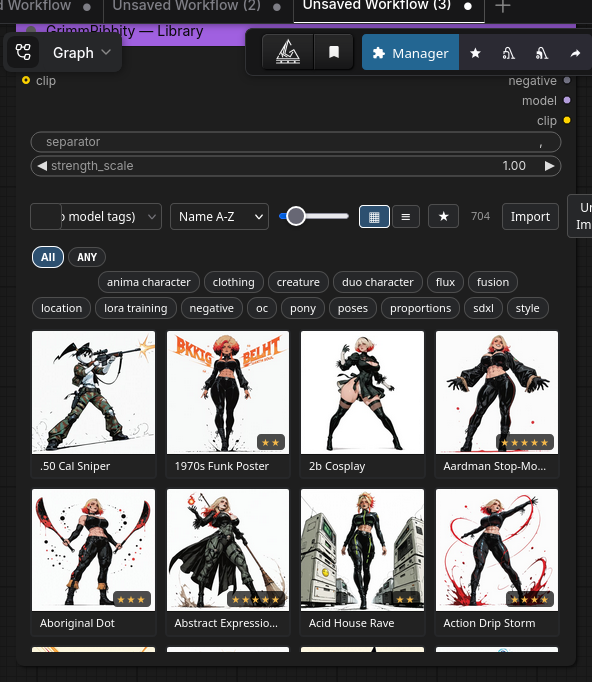
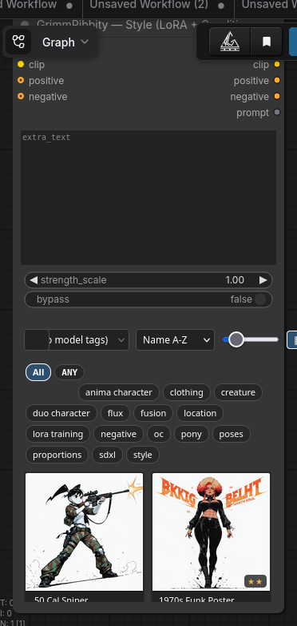
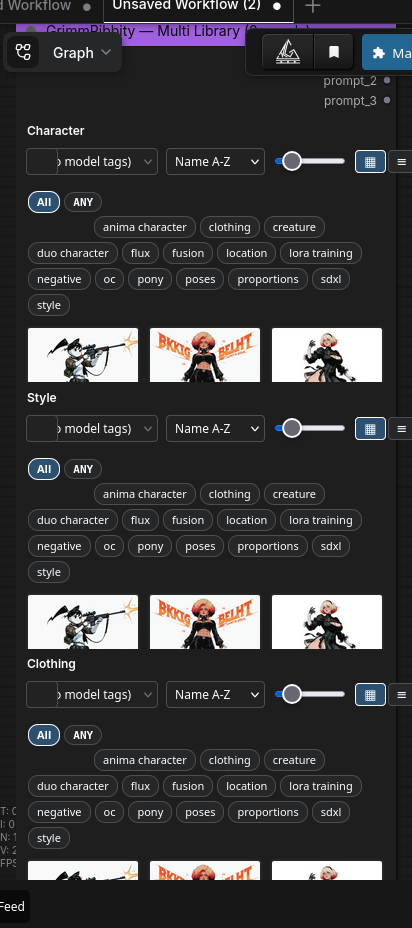
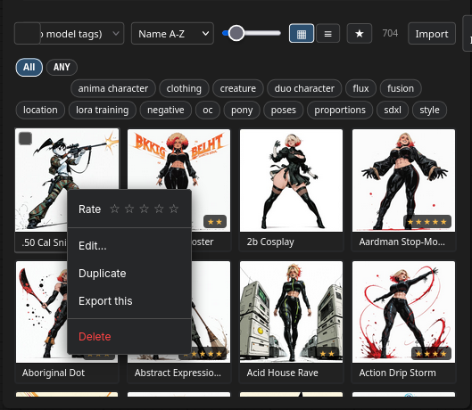
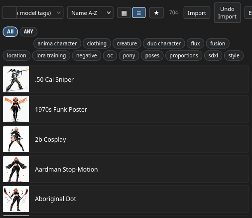
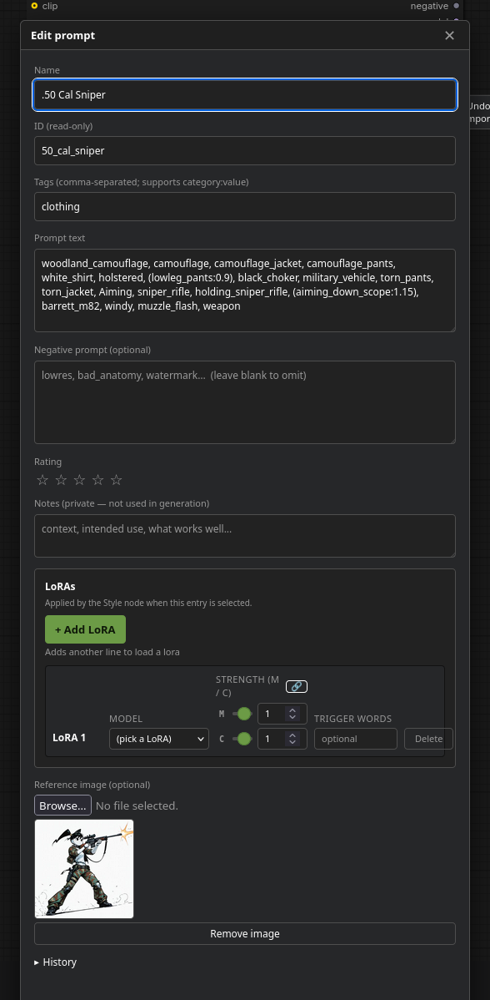
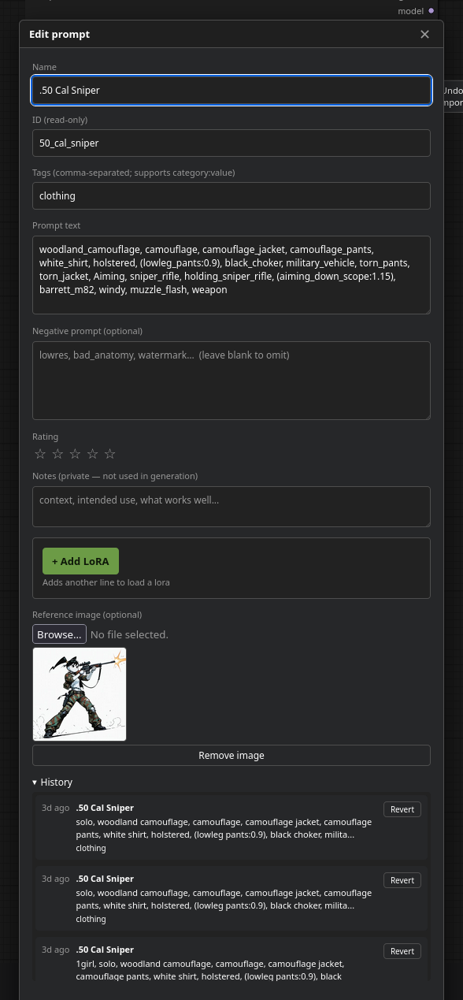

# GrimmRibbity — ComfyUI Custom Node Suite

[](https://github.com/Deaththegrim/ComfyUI-PromptLibrary/actions/workflows/tests.yml)

A visual prompt manager + detailer + sampler suite for ComfyUI (formerly *Ribbity — ComfyUI Prompt Library*). Browse a thumbnail grid of saved prompts, tag them, attach a per-entry LoRA stack, and drop the whole bundle into your workflow with one click. Filesystem-backed — your library survives browser clears and syncs cleanly across machines.

**~20 nodes**, one shared library, **zero ComfyUI custom-node dependencies** — every node imports only PyPI packages (torch, ultralytics, sam2, etc.) and ComfyUI core. Nodes that can leverage IPAdapter Plus (Character Anchor) lazy-import it at call time so the rest of the suite loads cleanly without it.

Highlights:
- **Library / Style / Multi** — visual prompt picker with per-entry LoRA stacks; selection persists across page refreshes via three-tier mirroring (widget value → node properties → localStorage)
- **Smart Detailer** — one node replaces the 3-node FaceDetailer chain. 6 detail targets (face / eyes / mouth / hands / feet / skin), SAM mask refinement, per-target threshold/denoise/max/steps/crop_factor overrides, color-coded detection-preview output. **No Impact Pack required** — uses `ultralytics` directly.
- **SDXL + Anima samplers** — SDXL_TUPLE-driven (efficiency-nodes wire-compatible) plus a flow-matching sampler for Qwen/Flux/SD3, both with a HiResFix script pipe (5 rounds of caching/perf optimization)
- **Save Image (Civitai)** — SaveImage replacement that writes A1111/Civitai-compatible PNG metadata; auto-detects model/LoRAs/seed from the workflow trace
- **Comic Page (Regional)** — single-gen multi-panel conditioning via a color-coded layout mask

## Screenshots

The Library node embeds a full thumbnail gallery — search, tag-filter, multi-select, and drop the joined prompt text right into your workflow:


The Comic Frame node combines a character, scene, and background entry into one prompt — so a single workflow can iterate across hundreds of style/character/outfit combinations:


Plug it into your sampler with a Power Lora Loader for one-click LoRA stacks — or use the new **Style node** (since v0.29.0) to bake the LoRA stack right into the gallery entry:


## Install

> **Get it from one of these — don't grab the unversioned `Code → Download ZIP` button or random commits.**
> - **ComfyUI-Manager** — easiest. Search *GrimmRibbity* (or *Ribbity — Prompt Library*) and install. Manager always pulls the latest tagged release.
> - **GitHub Releases** — [latest release](https://github.com/Deaththegrim/ComfyUI-PromptLibrary/releases/latest). Use the *Source code (zip)* asset, not random older versions.
> - **git clone** — see below; tracks `main`, which is the same as the latest tag.

### Comfy Portable (Windows)

1. Download the *Source code (zip)* asset from the [latest release](https://github.com/Deaththegrim/ComfyUI-PromptLibrary/releases/latest).
2. Extract into `ComfyUI_windows_portable\ComfyUI\custom_nodes\`. The zip extracts as `ComfyUI-PromptLibrary-<version>\` — **rename it to `ComfyUI-GrimmRibbity`** so the path becomes `…\custom_nodes\ComfyUI-GrimmRibbity\__init__.py`.
3. Restart ComfyUI.

### Linux / Mac (git clone)

```sh
cd ComfyUI/custom_nodes
git clone https://github.com/Deaththegrim/ComfyUI-PromptLibrary ComfyUI-GrimmRibbity
# restart ComfyUI
```

The `ComfyUI-GrimmRibbity` argument at the end is the local folder name — keep it as shown.

To update later:
```sh
cd ComfyUI/custom_nodes/ComfyUI-GrimmRibbity
git pull
# restart ComfyUI
```

Your `data/` folder is gitignored, so `git pull` won't touch your library. On first launch after a version bump, the package automatically copies `data/` to `data-backup-<old_version>-<timestamp>/` next to it as a safety net.

## Nodes

After install, find them under **GrimmRibbity/** sub-menus in the node picker:

**Library (the core suite)**
- **GrimmRibbity — Library** — visual gallery picker. Outputs `prompt` (positive) and `negative` STRINGs from the selected entry/entries. **If MODEL + CLIP are wired in (optional)**, the LoRA stack attached to every selected entry is applied in pick-order and patched MODEL/CLIP are emitted on the matching outputs — single node replaces a Library + Power Lora Loader chain. Multi-tile selection stacks every entry's LoRAs.

  
- **GrimmRibbity — Style (LoRA + Conditioning)** — like the Library node above but takes the next step: also encodes the joined positive + negative on the patched CLIP and emits `CONDITIONING` outputs (concatted onto optional inputs). Same gallery, same LoRA stack, but skips the separate CLIPTextEncode step. `bypass` toggle for A/B comparisons; `strength_scale` multiplies every LoRA at once.

  
- **GrimmRibbity — Multi Library (3 panels)** — three independent gallery panels in one node, replaces 3× Library + 2× Join Strings spaghetti. Each panel keeps its own search / tag-filter / sort / selection state, persisted per-panel across page refreshes (v0.57.1: fixed a localStorage collision where the three panels stomped each other's saved selection).

  
- **GrimmRibbity — Save** — write prompts to the library during workflow runs. Inputs: `name`, `text`, optional `negative`, optional `IMAGE` thumbnail, optional `tags`, optional `prompt_id` (override target id), `overwrite_by_name` (when set, updates the most-recently-edited entry sharing the typed name instead of appending a new one), `loras_json` (programmatic LoRA stack as JSON). Logs the lookup path on every save (`via=prompt_id` / `via=overwrite_by_name` / `via=new`) so a sticky widget value is visible in the console.
- **GrimmRibbity — Random by Tag** — pick a random library entry by tag filter (outputs text, id, negative). Built for overnight loops
- **GrimmRibbity — Wildcard Expand** — expand `{a|b|c}` alternatives and `__name__` library refs in any string

**Comic / character workflow helpers**
- **GrimmRibbity — Comic Frame** — combines character + scene + background entries into one prompt, with per-frame seed offset for comic batches
- **GrimmRibbity — Scene** — per-frame scene knobs (camera_angle, mood, lighting, framing) + free-text extras
- **GrimmRibbity — Background (locked)** — locked background preset for series consistency
- **GrimmRibbity — Character Anchor** — wraps IPAdapter Plus's UnifiedLoader + Apply pair into a single MODEL→MODEL transform. Pin a character's face/style across comic panels with one node instead of three. Includes a `bypass` toggle and an `attn_mask` input for regional workflows. **Requires [ComfyUI_IPAdapter_plus](https://github.com/cubiq/ComfyUI_IPAdapter_plus).**
- **GrimmRibbity — Smart Detailer** — one node replaces the 3-node FaceDetailer chain. **Six detail targets** (face / eyes / mouth / hands / feet / skin), each with its own enable toggle, bbox-detector dropdown, and a per-target column in the in-node grid for `threshold` / `denoise` / `max N` / `steps` / `crop_factor` overrides. Optional SAM mask refinement so blends follow the actual region outline instead of a rectangular feather. Tiled VAE decode defaults ON for OOM safety, conditional tile policy avoids the overhead on small crops, NaN-scrubbed output. Color-coded `detections_preview` IMAGE output draws labelled bboxes per target — wire to a SaveImage to debug detection without queueing sample work. **No ComfyUI custom-node dependencies** — uses `ultralytics` (and optionally `sam2` / `segment_anything`) directly.

  Drop YOLO detector .pt files into `models/ultralytics/bbox/`. Recommended set: [Anzhc/Anzhcs_YOLOs](https://huggingface.co/Anzhc/Anzhcs_YOLOs) for face + eyes (YOLO11n), [Civitai #329458](https://civitai.com/models/329458) for hands (YOLOv9c — catches partial / off-angle hands the v8s misses), [Civitai #1306938](https://civitai.com/models/1306938) for mouth, [Civitai #2511165](https://civitai.com/models/2511165) for feet/shoes.
- **GrimmRibbity — Comic Page (Regional)** — single-gen multi-panel conditioning. Take a color-coded panel-layout mask + per-panel prompts (up to 6 panels) and emit one CONDITIONING constrained per region. Optional `panel_strengths` CSV override (`"1.0, , 1.5"`) lets one panel dominate without changing every panel's binding. Pair with Character Anchor upstream for character lock across panels. **No third-party node packs required** — uses only ComfyUI's core CLIPTextEncode + ConditioningSetMask.

**Output**
- **GrimmRibbity — Save Image (Civitai)** — SaveImage replacement that writes A1111/Civitai-compatible PNG metadata. Auto-detects model, LoRAs, positive/negative, seed, sampler, scheduler from the workflow trace. Override any field if auto-detect picks the wrong sampler in multi-KSampler workflows
- **GrimmRibbity — Thumbnail Saver** — writes library thumbnails on workflow runs

**Sampling (optional, requires torch)**
- **GrimmRibbity — SDXL Sampler** + **Pack SDXL Tuple** — SDXL_TUPLE-driven sampler. Wires the way efficiency-nodes' SDXL_TUPLE does (drop-in compatible). Exposes `denoise` for img2img, optional `script` input for HiResFix.
- **GrimmRibbity — Anima Sampler** — KSampler-shaped sampler for Qwen / Flux / SD3 / any flow-matching base. Pre-encoded CONDITIONING + MODEL + LATENT directly, no SDXL-specific tuple.
- **GrimmRibbity — HiResFix Script** (SDXL) — latent / pixel / both upscale, optional checkpoint swap, per-iteration ControlNet anchoring, per-field hires prompt overrides, 1–5 iterations. Pixel upscale model + ControlNet load **once per run** instead of once per iteration; hires checkpoint cached across workflow re-runs (1-slot LRU). Auto-tiles VAE decode for outputs >1536px.
- **GrimmRibbity — Anima HiResFix Script** — shape-agnostic latent upscale (works on 5D Qwen latents). Per-iteration ProgressBar, refinement-only mode at scale=1.0, same auto-tile decode.

**Upscale**
- **GrimmRibbity — Upscale SDXL** *(new in v0.57.1)* — single-node tile-diffusion upscaler. Pre-upscales the input (via `upscale_model` if wired, otherwise Lanczos to `upscale_by`), optionally applies an SDXL tile ControlNet to the conditioning, then walks the canvas tile-by-tile with a low-denoise sampler and feather-blends each tile back in. Defaults match the Magnific Precise V2 / Clarity recipe (denoise 0.25, CFG 4.0, CN strength 0.5, 512 px tiles). `bypass=True` skips the diffusion pass and returns the upscaled image directly. Replaces the LoadControlNet + ApplyControlNet + UltimateSDUpscale chain with one node, all knobs exposed.

Both samplers have an opt-in `save_prompt_log` toggle (default off) — when enabled, every queued sample appends one JSONL line to `prompt_log_path` (empty = `<output>/prompt_logs/prompts.jsonl`) with the positive + negative prompts, the LoRA stack walked from the workflow trace, the model, and the sampler params (seed/steps/cfg/sampler_name/scheduler). One growing file per overnight batch — `jq`-friendly, no per-image directory pollution.

**LoRA picker**
- **GrimmRibbity — LoRA Picker** — dropdown picker that emits a `<lora:path:weight>` token for downstream parsing (rgthree Power LoRA Loader / A1111-style)

### Negative prompt field

Every entry can store an optional `negative` field alongside its positive `text`. The Library, Save, and Random nodes all flow it on a second STRING output. Wire that into the negative side of your sampler. Backward-compatible — entries without a negative field load as empty.

## Gallery

The Library node embeds a full gallery in the node body:

- Click a thumbnail to toggle it in the selection. The output is the **joined text** of every selected entry, separated by the node's `separator` input (default `, `).
- Shift-click range-extends the selection from the last-clicked tile.
- The same selection drives the bulk bar at the top — with one or more selected you get **Tag / Export / Delete**.
- Right-click a tile for **Edit / Duplicate / Export this / Delete**.

  
- Toolbar **▦ / ≡** switches between thumbnail grid and single-column list view (the list is good for dense libraries — 56 px thumb on the left, full name on the right).

  
- Drag-and-drop tiles to reorder when sort mode is **Manual**.
- Keyboard: arrow keys move focus, **Enter** toggles selection on the focused tile, **Delete** removes, **/** focuses search, **Esc** clears the selection.

### Toolbar

| Control | What it does |
|---|---|
| Search | Matches name, text, **negative**, tags, id, **notes**, **LoRA names + trigger words**. Multi-term AND, debounced 80 ms. |
| Model dropdown | Lifts `model:*` tags into a top-level filter (Anima, SDXL, Pony, …) |
| Sort | Manual (drag-reorder) / Name A-Z / Z-A / Newest / Oldest / Recent edit |
| ★ favorites | Filter to entries with rating ≥ 4 |
| Tile size slider | 60–200 px, persisted per browser |
| ▦ / ≡ view toggle | Thumbnail grid vs single-column list |
| ⚠ N (health badge) | Library validator findings; click for the modal — appears only when there are unhealed issues |
| Import | Auto-detects `.csv` (columns: `name, text, tags, id` — tags use `;` inside cell) or GrimmRibbity `.zip` |
| Undo Import | Restores the snapshot taken right before the last bulk import |
| Export | Packs currently visible prompts + thumbnails into a zip download |
| Scan LoRAs | Bulk-imports every file in `models/loras/` as a tagged library entry |
| Import BG | Bulk-imports the curated background presets |
| Queue All ▶▶ | Queues the current workflow once per selected (or visible) entry |
| Refresh | Reload from disk |

### Tag chips

Tags use `category:value` syntax (e.g. `style:cyberpunk`, `character:elf`). The chip row groups them by category. Chips OR-filter the grid; combine with the search box for AND.

`model:*` tags are special — they're lifted out of the chip row into the dedicated dropdown.

### Editing

Right-click → Edit, or click the `+` tile to add. The modal is non-blocking — drag it around, the canvas stays interactive. Fields:

- **Name** — human-readable label
- **ID** — auto-derived from the name (`Cyberpunk Style` → `cyberpunk_style`); override only if you want a specific filesystem name. Collisions auto-append `_2`, `_3`, …
- **Tags** — comma-separated; autocompletes from existing tags via a `<datalist>`
- **Prompt text** — the actual prompt string
- **Negative prompt** — optional, flowed on the second STRING output of the loader nodes
- **Rating** — 0-5 stars, drives the favorites filter
- **Notes** — private; not used in generation; searchable
- **Reference image** — optional thumbnail; PNG/JPG/WebP/GIF/BMP, capped at 16 MB. Paste an image with Ctrl+V while the modal is focused.
- **LoRAs** — up to 10 per entry. Click `+ Add LoRA` to attach a row (Model dropdown / **M+C strength sliders with link toggle** / Trigger words / Delete). Each row has independent `strength_model` and `strength_clip` controls; the 🔗 / 🔓 button locks them to move together. Soft-delete: the Delete button toggles to **Restore** until you Save the modal. Missing LoRA files are flagged with a visible warning row above the dropdown. Consumed by the **Library** node (when MODEL+CLIP are wired) and the **Style** node (which also encodes prompts on the patched CLIP). Trigger words are appended after the prompt before encoding.

  
- **History** — disclosure showing every prior version of this entry (max 20). Click any row to revert. Tracks LoRA-only changes too.

  

### Library health

A toolbar `⚠ N` badge appears when the validator finds unhealed issues. Click it for a categorised modal:

- **Broken LoRA references** — entries whose `loras` list points at a `.safetensors` no longer in `models/loras/`. Per-row Edit jumps into the entry.
- **Orphan thumbnails** — image files in `data/images/` with no matching entry. One-click bulk cleanup.
- **Invalid entry IDs** — would refuse to upsert.
- **Empty-text entries** — half-completed saves.

The badge auto-refreshes after every gallery refresh; clean libraries get no UI clutter (badge hidden at zero issues).

## Wildcards & overnight loops

Inside any prompt text:

- `{red|green|blue}` — picks one at random per generation
- `__character__` — resolves to a random library entry whose **id** matches `character`, or whose **tags** contain `character`. Recurse-safe (max depth 8); cycles bottom out as literals.

For a fully randomized overnight loop, chain three **Random by Tag** nodes:

```
[Random by Tag: character]  ─┐
[Random by Tag: background] ─┼─ concat ─→ CLIP Text Encode ─→ KSampler
[Random by Tag: action]      ─┘
```

Each node has a `seed` input — set `control_after_generate=randomize` to draw a fresh combination every queue. Wildcards in the picked prompts (`old {grumpy|wise} wizard`) re-roll per generation.

The Wildcard Expand node has independent toggles for `expand_choices` and `expand_named_refs` if you want one without the other.

## Storage

Everything lives in `ComfyUI-GrimmRibbity/data/`:

```
data/
├── prompts.json           # entries: id, name, text, tags, history, timestamps
├── images/<id>.<ext>      # thumbnails
└── .last_version          # auto-backup marker
```

Both `prompts.json` and `images/` are gitignored. Back up the whole `data/` folder to keep your library safe across reinstalls.

External edits to `prompts.json` are picked up automatically — the gallery polls the file every 2 s and refreshes on change. So you can version-control your library in git or edit it in your favourite text editor.

## Sharing libraries

- **Export some prompts**: filter the gallery (search, tags, model, anything), click **Export**. You get a zip with `prompts.json` + thumbnails.
- **Send the zip** to a friend.
- **They click Import** in their gallery and pick the zip. Existing entries with the same id get history-bumped before being overwritten; new ones are appended.

Same flow works for backups: export the whole library to a zip and stash it.

## CSV import

For seeding from a spreadsheet, save as CSV with these columns (header row required):

| name | text | tags | id |
|---|---|---|---|
| Cyberpunk Style | "vibrant neon, rain" | style;cyberpunk | (blank) |
| Wizard | "old man with staff" | character;fantasy | wizard |

- `name` is required
- `text` is the prompt body
- `tags` use `;` as the in-cell separator (because `,` is the CSV delimiter)
- `id` is optional; blank means auto-derive from name

## Standalone CLI tools

Five scripts in `tools/` run independently of a live ComfyUI server. Useful for batch maintenance over an SSH session or as cron jobs.

```sh
# Diagnose library issues — reports broken LoRA refs / orphan thumbnails /
# invalid ids / empty-text entries. Read-only by default; --fix-orphans
# bulk-deletes the stray thumbnails.
python3 tools/library_validate.py [--fix-orphans] [--quiet]

# Backfill A1111/Civitai-compatible 'Hashes:' metadata on PNGs from before
# the Civitai Save node was wired in. Walks a folder, reads each PNG's
# embedded workflow trace, computes SHA256s for the model + LoRAs, and
# rewrites the parameters chunk. Idempotent — already-tagged PNGs skip.
python3 tools/civitai_backfill.py /path/to/output [--recursive] [--dry-run]

# Repair Smart Detailer widget-value shifts in workflow JSONs saved against
# an older version of the node. Walks every GrimmRibbitySmartDetailer node,
# type-coerces salvageable values into the current widget order, and falls
# back to defaults for unrecoverable slots. Original kept as <file>.bak.
python3 tools/fix_workflow_widgets.py <workflow.json> [-o]

# Live monitor for ComfyUI process — polls /queue, samples RSS / CPU / VRAM
# / GPU temp every 0.5s, prints per-run summary with peak RSS delta and
# VRAM peak when the queue empties. Run alongside ComfyUI for the bug-and-
# monitor matrix on long Smart Detailer batches.
python3 tools/detailer_monitor.py [--interval 0.5] [--port 8188]

# Capture deterministic gallery + modal screenshots via headless Firefox
# (useful for refreshing the docs after a UI change).
python3 tools/screenshots/run.py
```

## HTTP routes

The ComfyUI server gains 17 routes under `/prompt_library/*`. Highlights:

- `GET /list` / `POST /upsert` / `POST /delete` / `POST /bulk_delete` — CRUD over entries
- `POST /export` / `POST /import_zip` / `POST /import_csv` — bulk transfer
- `GET /validate` / `POST /fix_orphans` — library health check
- `GET /loras` — installed LoRA filenames (drives the modal dropdown)
- `GET /history/{id}` / `POST /revert` — per-entry history
- `POST /scan_loras` — bulk-import LoRAs as library entries
- `POST /restore_snapshot` / `GET /snapshots` — recover from a destructive bulk op

Bodies are validated; size caps applied (16 MB image, 50 MB CSV, 500 MB ZIP compressed / 2 GB uncompressed). All POST routes accept JSON; all return JSON. The export route returns a zip body with `Content-Disposition: attachment`.

## Compatibility & deps

- ComfyUI any reasonably recent version (tested with 0.19.x, frontend 1.42.x)
- Python 3.10+
- No third-party deps beyond what ComfyUI already ships (`aiohttp`, `numpy`, `Pillow`)

## Development

```sh
git clone https://github.com/Deaththegrim/ComfyUI-PromptLibrary ComfyUI-GrimmRibbity
cd ComfyUI-GrimmRibbity
python3 -m venv .testenv
.testenv/bin/pip install aiohttp pillow
.testenv/bin/python -m unittest discover tests
```

322 tests, runs in ~3 s. The Comic Page tests + the Smart Detailer + Style node helper tests skip without `torch` installed (`.testenv` doesn't ship it). The Set/Get compatibility tests skip when `comfy.*` isn't on `PYTHONPATH`.

## Troubleshooting

### "Save node is overwriting the wrong entry"

Both `PromptLibrarySave` and `PromptLibraryThumbnailSaver` log their target on every run:

```
[PromptLibrary] saved id='X' name='X' via=prompt_id ...        ← targeting by stuck id
[PromptLibrary] saved id='X' name='X' via=overwrite_by_name ... ← name-match fired
[PromptLibrary] saved id='X' name='X' via=new ...              ← new entry created
[ThumbnailSaver] wrote thumbnail to id='X' name='Y'
```

If `via=prompt_id` fires when you expected `overwrite_by_name`, the Save node has a `prompt_id` widget value pinned in the workflow JSON (a one-time test value, an accidental wire, etc.) — clear that field and `overwrite_by_name` will fire.

When multiple entries share a name, `overwrite_by_name` targets the most-recently-edited match (since v0.46.1).

### "Library node is wired but not applying LoRAs"

The Library node's MODEL + CLIP inputs are both-or-neither for LoRA application. Wiring just one logs:

```
[PromptLibrary] WARNING: only one of MODEL / CLIP is wired — LoRA application requires BOTH.
```

Wire the matching socket or unwire both.

### "I have a half-set-up library and want to spot the bad rows"

Click the ⚠ N badge in the gallery toolbar (or run `python3 tools/library_validate.py` from the shell). Lists broken LoRA refs / orphan thumbnails / invalid ids / empty-text rows.

### "Smart Detailer fails validation after I update the suite"

ComfyUI loads workflow widget values by position. When new required widgets are added to a node across versions, saved values shift and end up in the wrong widget — symptom: validation errors saying things like `sampler_name='karras'` (a scheduler value) or `max_size=1` (was a boolean).

Two fixes:
- **Re-add the node**: right-click the Smart Detailer → Remove → re-add fresh. The new node has correct defaults.
- **Migrate the saved workflow JSON**: `python3 tools/fix_workflow_widgets.py <workflow.json> -o`. Walks every Smart Detailer node, type-coerces salvageable values into the current widget order, falls back to defaults for unrecoverable slots. Original is preserved as `<workflow.json>.bak`.

Going forward, new widgets land in `optional` so they don't shift required-widget positions — saved workflows from v0.53.1+ should remain stable.

### "Smart Detailer output is black / has weird color artifacts"

The detail pass pipeline used to skip a NaN scrub between VAE decode and the alpha-blend composite, so a sample-time NaN propagated into the final image and downstream `clip(0,1).astype(uint8)` casts produced black pixels. Fixed in v0.49.0 — `nan_to_num` runs after every refined-image path. If you still see this on v0.49.0+, share the console log; there's a different bug.

## Credits

See [CREDITS.md](CREDITS.md) for the full list. Short version: the suite is
co-created by **[Deaththegrim](https://github.com/Deaththegrim)** and
**RibbityRabbit**, pair-programmed with **[Claude Code](https://claude.com/claude-code)**.
The bundled tag library is a community contribution — curated by
**AceVanquish**, **Drow**, and the rest of the contributors.

If you contributed tags or want to, head to the
[GitHub repo](https://github.com/Deaththegrim/ComfyUI-PromptLibrary) and
open a PR or issue.

If you fork, remix, or publish a derivative, a credit line back to
[Deaththegrim/ComfyUI-PromptLibrary](https://github.com/Deaththegrim/ComfyUI-PromptLibrary)
is appreciated.

## License

MIT — see [LICENSE](LICENSE). You're free to use, modify, redistribute, and
include this in commercial work. The one ask: keep the copyright notice
("Copyright (c) 2026 Deaththegrim and RibbityRabbit") intact in copies and
substantial portions.
